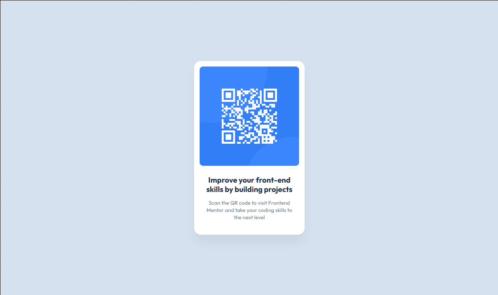

# Frontend Mentor - QR code component solution

This is a solution to the [QR code component challenge on Frontend Mentor](https://www.frontendmentor.io/challenges/qr-code-component-iux_sIO_H).

## Table of contents

- [Overview](#overview)
  - [Screenshot](#screenshot)
  - [Links](#links)
- [My process](#my-process)
  - [Built with](#built-with)
  - [What I learned](#what-i-learned)
- [Author](#author)
- [Acknowledgments](#acknowledgments)

## Overview

### Screenshot



### Links

- Live Site URL: [Add live site URL here](https://your-live-site-url.com)

## My process

### Built with

- Semantic HTML5 markup
- CSS custom properties
- Flexbox

### What I learned

- Using and following design files in Figma to get the design specifics
- Declaring and using CSS variables

```css
:root {
  --clr-Slate-900: #1f314f;
  --clr-Slate-500: #68778d;
  --clr-Slate-300: #d5e1ef;
  --clr-White: #ffffff;
}
```

```css
background-color: var(--clr-Slate-300);
```

- How to center items with flexbox

```css
.container {
  height: 100dvh;
  display: flex;
  justify-content: center;
  align-items: center;
}
```
